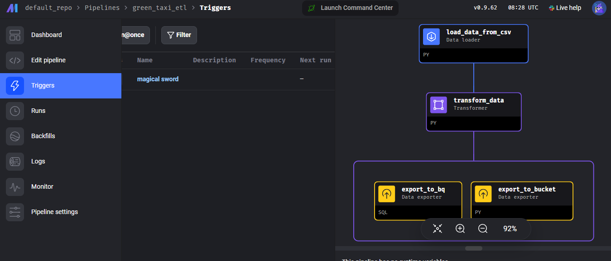
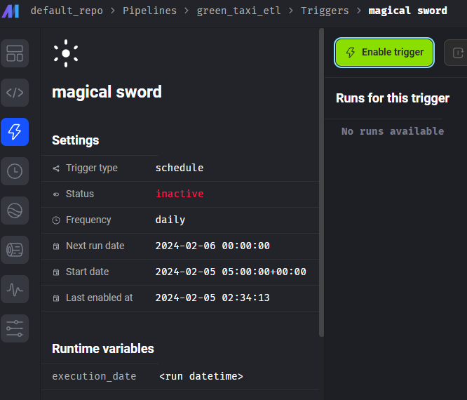

# Introduction

In order to deploy the infrastructure to the GCP cloud, Mage already provides the templates to deploy in different cloud providers, templates for **Terraform GCP** can be found in:
https://github.com/mage-ai/mage-ai-terraform-templates

Terraform installer can be found in, remember to **download Terraform inside the folder where the GCP templates are**:
https://developer.hashicorp.com/terraform/install

Finally, to deploy to GCP using Terraform you need to have an active connection in **gcloud CLI** to GCP, the installer for gcloud CLI can be found in:
https://cloud.google.com/sdk/docs/install

# Configure gcloud CLI
After installer via GUI or installer via package manager, is necessary to configure the connection with your GCP account and current proyect, in order to do so, open a CLI and run the following command:
```shell
gcloud auth application-default login
```
This will open a tab in web browser asking for authentication, sign in into your account and allow permissions.

Now, create a **service account with owner permissions** and create a **JSON key** for this user, **move this key in a location inside the folder of the Terraform templates to deploy Mage**.

# Deploy with Terraform
After downloading templates, make sure to **modify the following Terraform variables** to set your own identification values:
```JSON
variable "project_id" {
  type        = string
  description = "The name of the project"
  default     = "<ID_OF_YOUR_PROJECT>"
}
```
```JSON
variable "database_user" {
    type = string
    description = "The username of the Postgres database."
    default= "<YOUR_DATABASE_USER>"
}
```
Now, add the **credentials location** to your **provider block** inside the **terraform file main.tf** as:
```JSON
provider "google" {
  credentials = file("<PATH_TO_CREDENTIAL_JSON>")
  project = var.project_id
  region  = var.region
  zone    = var.zone
}
```
After this, inside your **Terraform templates folder**, open a CLI and run:
```shell
terraform init
```
This should run the **Terraform backend**, after this if no error appears, try to format the files by running:
```shell
terraform fmt
```
Now review your resources to be created by running:
```shell
terraform plan
```

To **deploy Mage**, run:
```shell
terraform apply
```

After this, a promtp **asking for your dabatase password** is shown, write a password you can remember to enter your database.

Finally, a new prompt asking for **confirmation to deploy** the resourcers, in this prompt **type yes** to deploy the entire infrastructure.

If nothing goes wrong, at the end of the resources deployment a variable will be printed that represents the **ip where Mage can be accessed.**

# Homework - Local
Homework description for this module can be found in here:
https://github.com/DataTalksClub/data-engineering-zoomcamp/blob/main/cohorts/2024/02-workflow-orchestration/homework.md

And data used can be found in the following link:
https://github.com/DataTalksClub/nyc-tlc-data/releases/tag/green/download

Where links for data in the last quarter of 2020 are:
- https://github.com/DataTalksClub/nyc-tlc-data/releases/download/green/green_tripdata_2020-10.csv.gz
- https://github.com/DataTalksClub/nyc-tlc-data/releases/download/green/green_tripdata_2020-11.csv.gz
- https://github.com/DataTalksClub/nyc-tlc-data/releases/download/green/green_tripdata_2020-12.csv.gz

## Load Data
In order to load data, we can make use of **pandas** method ````pandas.read_csv`` inside this method we can **directly insert the URL of the CSV file**, also if they are compressed we can directly read the files by setting the parameter ````compression``, an example is as follows:
```python
url = "https://github.com/DataTalksClub/nyc-tlc-data/releases/download/green/green_tripdata_2020-10.csv.gz"
df_tmp = pd.read_csv(element, compression="gzip", low_memory=False)

```
## Trasform Data
For this case, we are asking to transform data as the following requirements:
- Set all columns in snake case.
- Create a column called ```lpep_pickup_date``` by converting ```lpep_pickup_datetime``` to a date.
- Remove rows where the passenger count is equal to 0 and the trip distance is equal to zero.

### Set all columns to snake case
We can take the columns from the data frame as:
```python
columns = df.columns
```
We can iterate and transform over this column by appending ```str``` transfomations as:
```python
df.columns = (df.columns
              .str.lower()
              .str.replace(" ", "_")
              .str.replace("id","_id")
              .str.replace("pul","pu_l")
              .str.replace("dol","do_l")
)
```
The usage of the **vectorized string functions** ```str``` allow to treat the columns as any other string object.

### Create a column called ```lpep_pickup_date```
Same as with the columns, we can make datetime ```dt``` transformations as follows:

```python
df["lpep_pickup_date"] = df["lpep_pickup_datetime"].dt.date
```

The usage of the **accessor object** ```dt``` allows to use the properties of datatime objects for pandas Series.

### Remove rows where the passenger count is equal to 0 and the trip distance is equal to zero.
This can be easily done by filtering by columns in a dataframe as follows:
```python

df_filtered = df[(df["passenger_count"] > 0) & (df["trip_distance"] > 0)]
```

## Export Data
To export data to a **parquet** format we need to use the ```PyArrow``` python package.

We first need to create a ```table``` that is an object compatible to ```PyArrow``` that comes from a data frame, this can be done as:
```python
import pyarrow as pa
table = pa.Table.from_pandas(df)
```

Now, to write into a parquet file, we need to use the ```parquet``` object from ```PyArrow``` as follows:
```python
import pyarrow.parquet as pq
pq.write_to_dataset(
	table,
	root_path="./green_taxi_data",
	partition_cols = ['lpep_pickup_date']
    )
```

All of the content for this process can be found in the jupyter notebook called *homework_local.ipynb*

# Homework - Mage in GCP
After executing ```terraform apply``` we can now access to the Mage instance that is living inside the cloud.
The IP to enter to the Mage instance, is shown at the end of the command.

## Create Pipeline
Inside the Mage instance, create a Pipeline as follows:
1. Click on **Pipelines** section at the left navbar
2. Select a **Standart(batch)** pipeline


## Extract data
1. Go to **Edit Pipeline** section
2. Create a **Generic Python Data Loader** block as follows:

3. Load data from URLs into a single dataframe, the code that must go inside the **Data Loader**, can be similar to:
```python
import pandas as pd

if 'data_loader' not in globals():
    from mage_ai.data_preparation.decorators import data_loader
if 'test' not in globals():
    from mage_ai.data_preparation.decorators import test

URLs = [
    "https://github.com/DataTalksClub/nyc-tlc-data/releases/download/green/green_tripdata_2020-10.csv.gz",
    "https://github.com/DataTalksClub/nyc-tlc-data/releases/download/green/green_tripdata_2020-11.csv.gz",
    "https://github.com/DataTalksClub/nyc-tlc-data/releases/download/green/green_tripdata_2020-12.csv.gz"
]


@data_loader
def load_data(*args, **kwargs):
    """
    Template code for loading data from any source.

    Returns:
        Anything (e.g. data frame, dictionary, array, int, str, etc.)
    """
    # Specify your data loading logic here
    df = pd.DataFrame()
    for element in URLs:
        df_tmp = pd.read_csv(element, compression="gzip", low_memory=False)
        df = pd.concat([df,df_tmp])

    return df


@test
def test_output(output, *args) -> None:
    """
    Template code for testing the output of the block.
    """
    assert output is not None, 'The output is undefined'

```
Output must look like:


## Transform data
1. Create a **Generic Python Transformer** block as:

2.- Transform data as stated, remember to add testing function:
```python
import pandas as pd

if 'transformer' not in globals():
    from mage_ai.data_preparation.decorators import transformer
if 'test' not in globals():
    from mage_ai.data_preparation.decorators import test


@transformer
def transform(data, *args, **kwargs):
    """
    Template code for a transformer block.

    Add more parameters to this function if this block has multiple parent blocks.
    There should be one parameter for each output variable from each parent block.

    Args:
        data: The output from the upstream parent block
        args: The output from any additional upstream blocks (if applicable)

    Returns:
        Anything (e.g. data frame, dictionary, array, int, str, etc.)
    """
    # Specify your transformation logic here

    # Set column string constraints
    data.columns = (data.columns
              .str.lower()
              .str.replace(" ", "_")
              .str.replace("id","_id")
              .str.replace("pul","pu_l")
              .str.replace("dol","do_l")
    )

    # Set datetime columns
    data["lpep_pickup_datetime"] = pd.to_datetime(data["lpep_pickup_datetime"])
    data["lpep_dropoff_datetime"] = pd.to_datetime(data["lpep_dropoff_datetime"])

    # Create date column
    data["lpep_pickup_date"] = data["lpep_pickup_datetime"].dt.date

    # Filter data
    data = data[(data["passenger_count"] > 0) & (data["trip_distance"] > 0)]

    return data


@test
def test_vendor_id(output, *args) -> None:
    """
    Template code for testing the output of the block.
    """
    assert "vendor_id" in output.columns, 'vendor_id is not in the columns'

@test
def test_passenger_count(output, *args) -> None:
    assert output[(output["passenger_count"] == 0)].empty == True, 'There are trips with 0 passengers'

@test
def test_trip_distance(output, *args) -> None:
    assert output[(output["trip_distance"] == 0)].empty == True, 'There are trips with 0 total distance'


```

After execution, output must look like:


## Export Data
Before being able to export data to **GCP**, first need to set the credentials into the Mage configuration, to do so, go to the ```io_config.yaml``` and search for the **GOOGLE_SERVICE_ACC_KEY** section as:


Copy the fields from the previously generated **JSON credentials** file for the service account.


### Export to BigQuery
Inside your pipeline
1. Create a **SQL Data Exporter** block as:

2. Inside that block remember to change the following values: **schema** to "*mage*" and **table** to "*green_taxi*"
3. Now, select the entire table as the following query:
```SQL
SELECT * FROM {{ df_1 }}
```
After execution, output must look like:


And now data must be **available in BigQuery**


### Export to Cloud Storage
After exporting multiple parquet partitions to GCP Cloud storage, you need to **set the JSON credentials inside your Mage instance**, to do so, in the **files section** of Mage, create a folder or direcly **create a JSON file**:

Now, copy the contents from the **JSON credentials** previously created, to the newly created JSON file.

If created under **default_repo** folder, the full path will be: ```/home/src/default_repo/<path_to_JSON>```.
Now your GCP credentials are in the Mage instance.

1. Create a **Python Generic Data Exporter** block as:

2. Use ```PyArrow``` module to make the data insertion to the bucket into GCP, remember to set the environment variable ```GOOGLE_APPLICATION_CREDENTIALS``` to the path where the JSON credentials file is, code can be as follows:
```python
import os

import pyarrow as pa
import pyarrow.parquet as pq

if 'data_exporter' not in globals():
    from mage_ai.data_preparation.decorators import data_exporter

# Set for GCP access to Cloud Storage
bucket_name = "stb-de-zoomcamp-mage"

# Set environment variable:
os.environ["GOOGLE_APPLICATION_CREDENTIALS"] = "/home/src/default_repo/keys/gcp_keys.json"

# Create table
table_name = "green_taxi"

# Create folder to store in bucket
root_path = f"{bucket_name}/{table_name}"


@data_exporter
def export_data(data, *args, **kwargs):
    """
    Exports data to some source.

    Args:
        data: The output from the upstream parent block
        args: The output from any additional upstream blocks (if applicable)

    Output (optional):
        Optionally return any object and it'll be logged and
        displayed when inspecting the block run.
    """
    # Create table in pyarrow schema
    table = pa.Table.from_pandas(data)

    # Create GCS Filesystem connection
    gcs = pa.fs.GcsFileSystem()

    
    pq.write_to_dataset(
        table,
        root_path=root_path,
        partition_cols = ['lpep_pickup_date'],
        filesystem=gcs
    )

```
After execution, no visible message is present, but files are available in bucket:


## Pipeline Scheduling
1. Go to the triggers menu:

2. Click on **+ New trigger** and select your pipeline
3. Now, select the **Schedule** option as:

4. Set dates and time for **5AM daily execution** execution as:

5. Finally, **save changes** and **enable trigger**


The pipeline is completely configured and ready to be executed:

