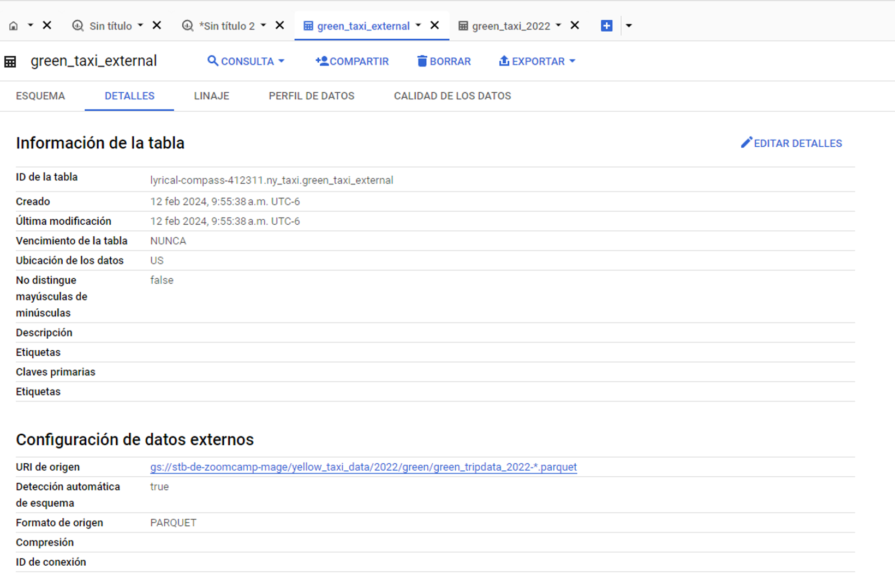
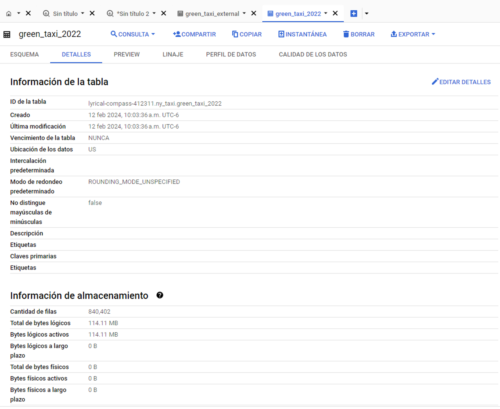

# Introduction
As part of the Data Engineering Zoomcamp from DataTalks, in this section for Data Warehouse using BigQuery solve for the following homework questionnaire:
https://github.com/DataTalksClub/data-engineering-zoomcamp/blob/main/cohorts/2024/03-data-warehouse/homework.md

# Set Up
Using the 2022 Green Taxi Trip Record Parquet Files from the New York City Taxi Data found here:

https://www.nyc.gov/site/tlc/about/tlc-trip-record-data.page

Directly load the files into the bucket, do not use an orchestrator.

Create an external table using the Green Taxi Trip Records Data for 2022.
Create a table in BQ using the Green Taxi Trip Records for 2022(do not partition or cluster this table)

From the Cloud Storage Bucket, get the URI for the uploaded parquet files, create an external table as follows:
```SQL
-- CREATE EXTERNAL TABLE
CREATE OR REPLACE EXTERNAL TABLE `lyrical-compass-412311.ny_taxi.green_taxi_external`
OPTIONS(
  format = "PARQUET",
  uris = ['gs://stb-de-zoomcamp-mage/yellow_taxi_data/2022/green/green_tripdata_2022-*.parquet']
);
```
URI from external table as:


Now, create the materialized table from the external table as:
```SQL
-- CREATE STORED TABLE
CREATE OR REPLACE TABLE `lyrical-compass-412311.ny_taxi.green_taxi_2022` AS 
SELECT * FROM `lyrical-compass-412311.ny_taxi.green_taxi_external`;
```
Storage of materialized table as:


# Questions
## Question 1
Question 1: What is count of records for the 2022 Green Taxi Data??

- 65,623,481
- ```840,402```
- 1,936,423
- 253,647

Query executed:
```SQL
-- COUNT RECORDS
SELECT COUNT(VendorID) FROM `lyrical-compass-412311.ny_taxi.green_taxi_2022`;
```

## Question 2
Write a query to count the distinct number of PULocationIDs for the entire dataset on both the tables.

What is the estimated amount of data that will be read when this query is executed on the External Table and the Table?

- ```0 MB for the External Table and 6.41MB for the Materialized Table```
- 18.82 MB for the External Table and 47.60 MB for the Materialized Table
- 0 MB for the External Table and 0MB for the Materialized Table
- 2.14 MB for the External Table and 0MB for the Materialized Table

For External table:
```SQL
-- DISTINCT PULocationsIDs: EXTERNAL
SELECT COUNT(DISTINCT PULocationID) FROM `lyrical-compass-412311.ny_taxi.green_taxi_external`;
```
Preview of execution:


For Stored table:
```SQL
-- DISTINCT PULocationsIDs: STORED
SELECT COUNT(DISTINCT PULocationID) FROM `lyrical-compass-412311.ny_taxi.green_taxi_2022`;
```


## Question 3
How many records have a fare_amount of 0?

- 12,488
- 128,219
- 112
- ```1,622``

Query executed:
```SQL
-- fare_amount of 0
SELECT COUNT(fare_amount) FROM `lyrical-compass-412311.ny_taxi.green_taxi_2022` WHERE fare_amount = 0;
```

## Question 4
What is the best strategy to make an optimized table in Big Query if your query will always order the results by PUlocationID and filter based on lpep_pickup_datetime? (Create a new table with this strategy)

- Cluster on lpep_pickup_datetime Partition by PUlocationID
- ```Partition by lpep_pickup_datetime Cluster on PUlocationID```
- Partition by lpep_pickup_datetime and Partition by PUlocationID
- Cluster on by lpep_pickup_datetime and Cluster on PUlocationID

Query executed
```SQL
-- Optimized query: Order results by PULocation and filter based on lpep_pickup_time
CREATE OR REPLACE TABLE `lyrical-compass-412311.ny_taxi.green_taxi_2022_partitioned_clustered`
PARTITION BY DATE(lpep_pickup_datetime)
CLUSTER BY PUlocationID AS
SELECT * FROM `lyrical-compass-412311.ny_taxi.green_taxi_2022`;
```

## Question 5
Write a query to retrieve the distinct PULocationID between lpep_pickup_datetime 06/01/2022 and 06/30/2022 (inclusive)

Use the materialized table you created earlier in your from clause and note the estimated bytes. Now change the table in the from clause to the partitioned table you created for question 4 and note the estimated bytes processed. What are these values?

Choose the answer which most closely matches.

- 22.82 MB for non-partitioned table and 647.87 MB for the partitioned table
- ```12.82 MB for non-partitioned table and 1.12 MB for the partitioned table```
- 5.63 MB for non-partitioned table and 0 MB for the partitioned table
- 10.31 MB for non-partitioned table and 10.31 MB for the partitioned table

For Materialized table:
```SQL
-- Retrieve PULocationID beteween lpel_pickup_datetime 06/01/2022 and 06/30/2022 from materialized table.
SELECT DISTINCT PUlocationID FROM `lyrical-compass-412311.ny_taxi.green_taxi_2022` WHERE lpep_pickup_datetime BETWEEN '2022-06-01' AND '2022-06-30';
```


For External Table:
```SQL
-- Retrieve PULocationID beteween lpel_pickup_datetime 06/01/2022 and 06/30/2022 from partitioned table.
SELECT DISTINCT PUlocationID FROM `lyrical-compass-412311.ny_taxi.green_taxi_2022_partitioned_clustered` WHERE lpep_pickup_datetime BETWEEN '2022-06-01' AND '2022-06-30';
```


## Question 6

Where is the data stored in the External Table you created?

- Big Query
- ```GCP Bucket```
- Big Table
- Container Registry

Not stored in BigQuery, directly read from GCP Bucket

## Question 7
It is best practice in Big Query to always cluster your data:

- True
- ```False```

For tables smaller than 1GB there will not be any significant improvement.

## Question 8
Write a `SELECT count(*)` query FROM the materialized table you created. How many bytes does it estimate will be read? Why?

There will be **0 B** read from the table as the count of elements is already stored in the metadata.
```SQL
-- Materialized table
SELECT COUNT(*) FROM `lyrical-compass-412311.ny_taxi.green_taxi_2022`;
```
